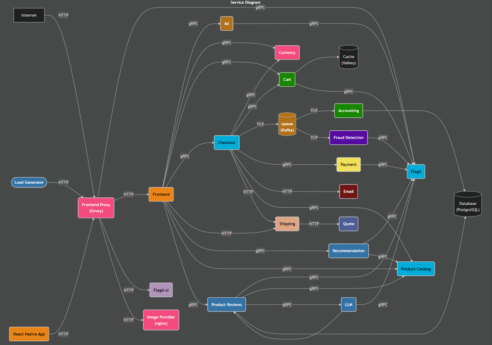
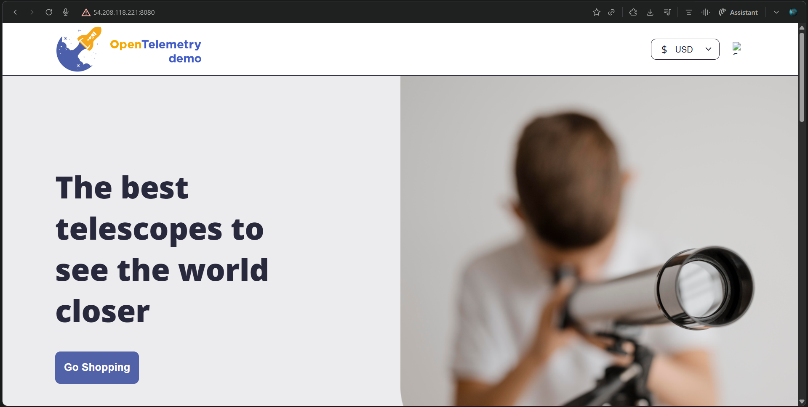
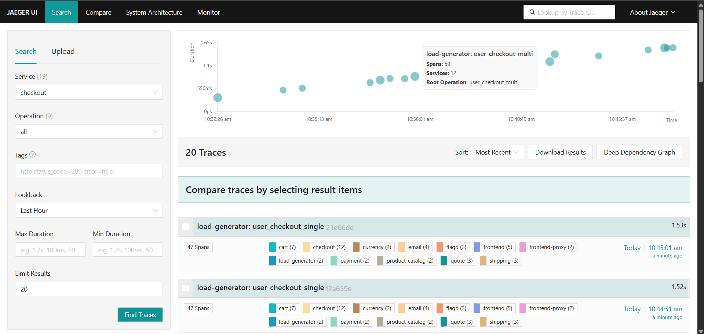
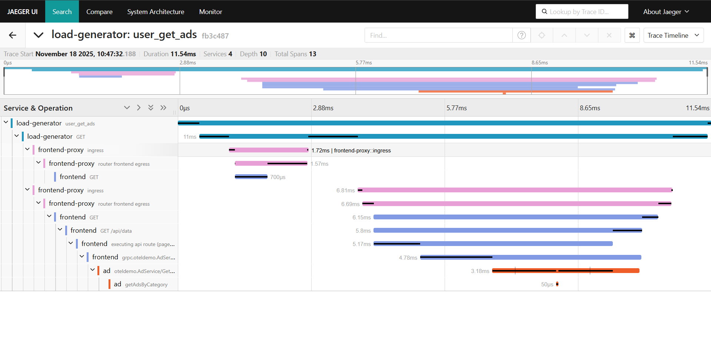
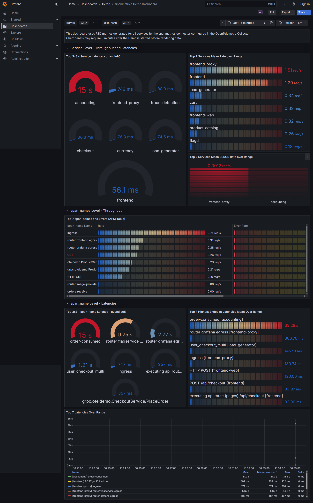
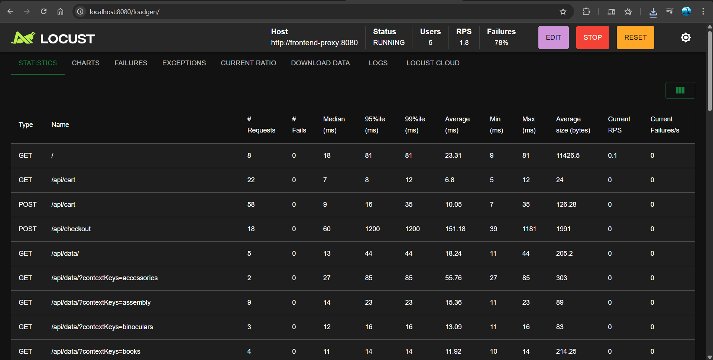

# Otel Astronomy Shop Demo App

This repository is a hands-on demo and DevOps walkthrough for deploying a microservices-based e‑commerce store instrumented with OpenTelemetry (OTel).

🚀 Introduction  
The Otel Astronomy Shop Demo App showcases distributed tracing, logging and metrics by instrumenting a cloud‑native multi‑service e‑commerce platform with OpenTelemetry. Follow the steps below to replicate the deployment, explore the architecture, and view live monitoring (Jaeger, Grafana, OpenSearch).

📦 Features
- Full microservices demo e‑commerce store
- OpenTelemetry automated tracing, logging, and metrics
- Visualization with Jaeger, Grafana and OpenSearch
- Feature flags for scenario simulation (src/flagd/demo.flagd.json)
- Load generation and traffic simulation tools

🏗️ Architecture Overview  
  

Microservices:
- Core demo services (multiple languages)
- Dependent services (Redis, Kafka, etc.)
- Observability stack (OTel Collector, Prometheus, Grafana, Jaeger, OpenSearch)

🖥️ Local / EC2 Demo Setup

Prerequisites
- Docker & Docker Compose
- Node.js (project-specific version in package.json)
- Recommended for EC2: Ubuntu 22, t2.xlarge (≥6–8GB RAM), 15GB storage

Quick deploy on Ubuntu EC2 (example)
```bash
# 1. Launch EC2 instance (Ubuntu 22 recommended)
# 2. SSH into instance, clone repo
git clone https://github.com/open-telemetry/opentelemetry-demo.git
cd opentelemetry-demo

# 3. Install Docker on Ubuntu (example steps)
sudo apt-get update
sudo apt-get install -y ca-certificates curl
sudo install -m 0755 -d /etc/apt/keyrings
curl -fsSL https://download.docker.com/linux/ubuntu/gpg -o /etc/apt/keyrings/docker.asc
echo "deb [arch=$(dpkg --print-architecture) signed-by=/etc/apt/keyrings/docker.asc] \
  https://download.docker.com/linux/ubuntu $(grep VERSION_CODENAME /etc/os-release | cut -d= -f2) stable" | \
  sudo tee /etc/apt/sources.list.d/docker.list > /dev/null
sudo apt-get update
sudo apt-get install -y docker-ce docker-ce-cli containerd.io docker-compose-plugin

# 4. Start the demo stack
sudo docker compose up --force-recreate --remove-orphans --detach
```

Note: Kafka and the full stack can be memory hungry. If services fail to become healthy, increase instance RAM (≥8GB recommended).

Accessing the demo (replace <HOST> with EC2-IP or localhost)
- Web Store: http://<HOST>:8080
- Grafana: http://<HOST>:8080/grafana
- Jaeger: http://<HOST>:8080/jaegerui
- Load Generator UI: http://<HOST>:8080/loadgen

🕹️ How it works
- Services emit telemetry (traces, metrics, logs) to the OTel Collector
- Collector processes and forwards data to backends (Jaeger, Prometheus, OpenSearch)
- Feature flags (src/flagd/demo.flagd.json) allow scenario simulation
- Use Grafana and Jaeger for visual diagnosis of performance and errors

📸 Demo screenshots  
Below are actual screenshots from my live deployment.

Home Page UI  


Jaeger Distributed Tracing  


Jaeger Span Timeline


Grafana Metrics Dashboard  


LoadGen UI  



🛠️ Configuration & Important Paths
- Source: /src
- OTel Collector config: src/otel_collector/otelcol-config.yml
- Feature flags: src/flagd/demo.flagd.json
- Docker Compose files: docker-compose.yml, docker-compose.minimal.yml, docker-compose-tests.yml

🔍 Observability & Debugging
- Jaeger: view traces and span timelines to identify latency/bottlenecks
- Grafana: visualize metrics and alerts
- OpenSearch: search and correlate logs
- Container logs: sudo docker compose logs -f

📚 References
- OpenTelemetry Documentation — https://opentelemetry.io
- Project repository and configs in this folder
- Feature Flags documentation in src/flagd

----